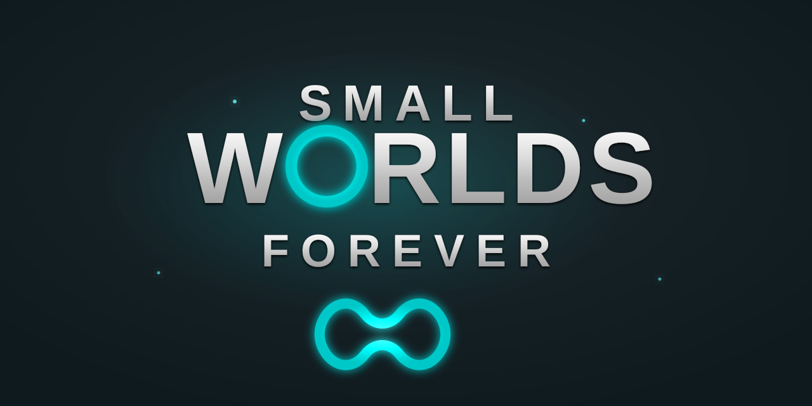

<p align="center">
  
</p>

# SmallWorlds Recreation Project

This project is a fan-driven effort to recreate the beloved virtual world, SmallWorlds. It aims to bring back the core functionalities and experience of the original game using modern web technologies. This is a non-commercial project built by fans, for fans.

## About The Project

This application is built using the Laravel framework and aims to replicate the server-side and client-side logic of the SmallWorlds game. It includes features like user authentication, avatar management, inventory, spaces, and more.

### Built With

*   [Laravel](https://laravel.com/)
*   [Vue.js](https://vuejs.org/)
*   PHP
*   MySQL

## Getting Started

To get a local copy up and running, follow these steps.

### Prerequisites

*   PHP
*   [Composer](https://getcomposer.org/)
*   Node.js & NPM
*   A database server (e.g., MySQL)
*   [Docker](https://www.docker.com/get-started)
*   [Docker Compose](https://docs.docker.com/compose/install/)

### Installation

1.  Clone the repository.
2.  Install PHP dependencies:
    ```sh
    composer install
    ```
3.  Install NPM packages:
    ```sh
    npm install
    ```
4.  Create a `.env` file by copying `.env.example`:
    ```sh
    cp .env.example .env
    ```
5.  Generate an application key:
    ```sh
    php artisan key:generate
    ```
6.  Configure your database and other environment variables in the `.env` file. Pay special attention to `DB_*` variables and custom variables like `AVATARS_URL` and `MEDIA_URL` from [config/custom.php](config/custom.php).
7.  Run the database migrations:
    ```sh
    php artisan migrate
    ```
8.  Compile front-end assets:
    ```sh
    npm run dev
    ```
9.  Start the local development server:
    ```sh
    php artisan serve
    ```

### Installation with Docker

If you prefer using Docker, you can use the following steps. This assumes you have a `docker-compose.yml` file configured for the project.

1.  Clone the repository.
2.  Create a `.env` file by copying `.env.example`:
    ```sh
    cp .env.example .env
    ```
3.  In your `.env` file, update the `DB_HOST` to match the name of your database service in `docker-compose.yml` (e.g., `mysql`).
4.  Build and start the services:
    ```sh
    docker-compose up -d --build
    ```
5.  Install PHP dependencies:
    ```sh
    docker-compose exec app composer install
    ```
6.  Generate an application key:
    ```sh
    docker-compose exec app php artisan key:generate
    ```
7.  Run the database migrations:
    ```sh
    docker-compose exec app php artisan migrate
    ```
8.  Install NPM packages and compile assets:
    ```sh
    docker-compose exec app npm install && docker-compose exec app npm run dev
    ```
The application should now be running and accessible in your browser.

## Contributing
Contributions are what make the open-source community such an amazing place to learn, inspire, and create. Any contributions you make are **greatly appreciated**.
1. Fork the Project
2. Create your Feature Branch (`git checkout -b feature/AmazingFeature`)
3. Commit your Changes (`git commit -m 'Add some AmazingFeature'`)
4. Push to the Branch (`git push origin feature/AmazingFeature`)
5. Open a Pull Request
## License
Distributed under the AGPL-3.0 License. See `LICENSE` for more information.
